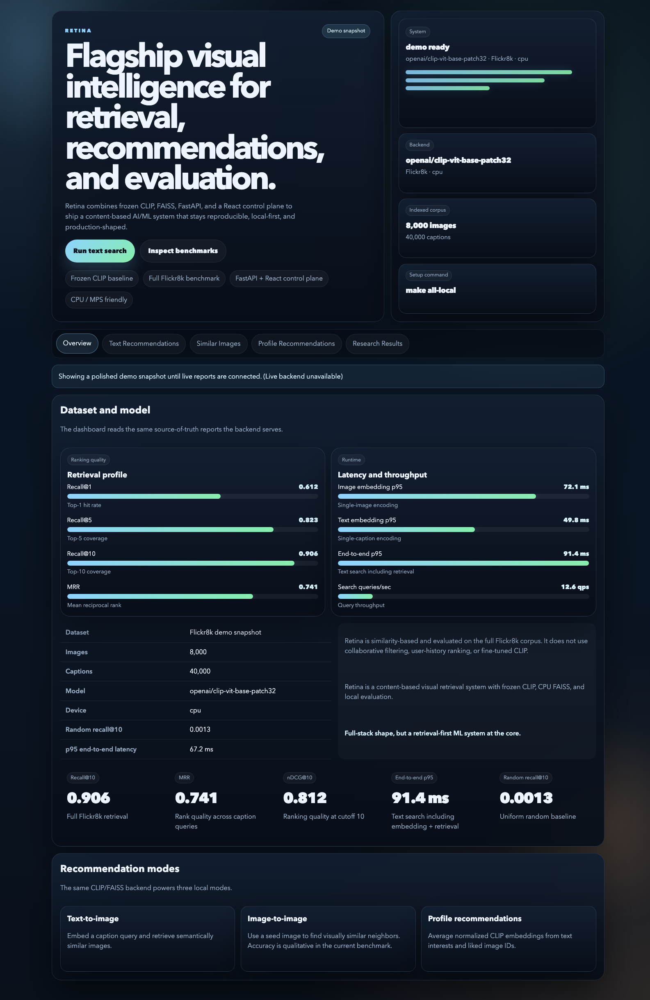
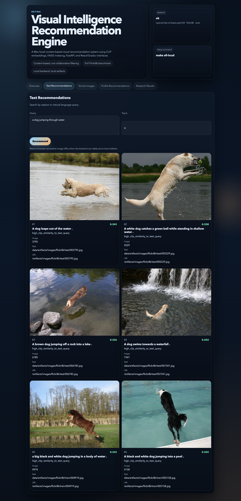
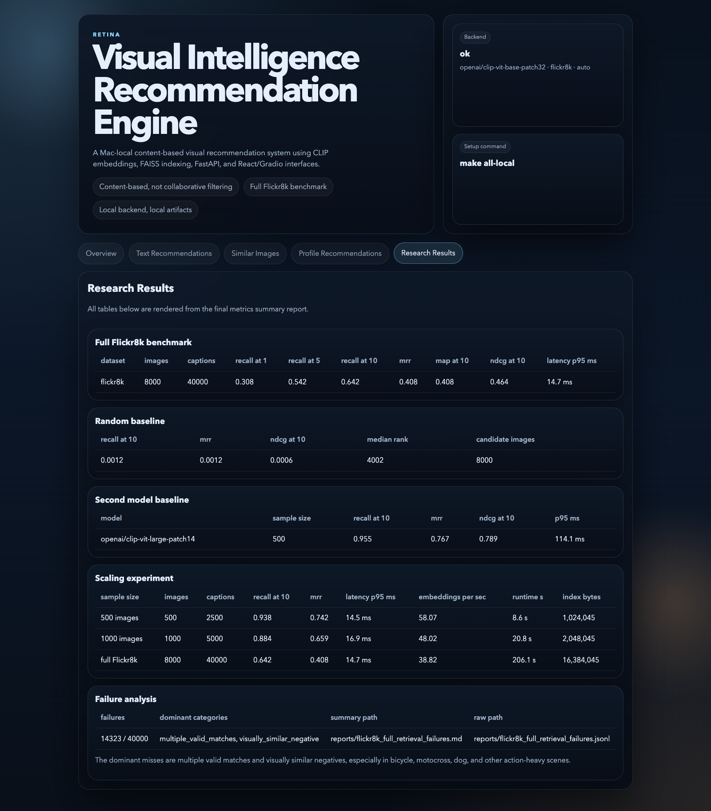

# Retina

## Visual Discovery Platform

A full-stack, Mac-local visual discovery app for quickly finding the right image from a large catalog using text, image, or profile-style intent.

## Business Need

Retina addresses a common product problem: people waste time manually scanning large image libraries when they really want to search by meaning, not filename.

It helps with:

- catalog search for e-commerce, media, and content operations
- creative review and asset reuse
- semantic discovery when users do not know exact image IDs or tags
- faster shortlisting of relevant visuals before a human makes the final decision

The app is end to end: the React UI captures the query, FastAPI executes the search, CLIP/FAISS ranks the results, and the browser shows the ranked outputs immediately.

## Screenshots







For a short recorded walkthrough script, see [docs/demo_video_instructions.md](docs/demo_video_instructions.md).

## Start Here

- [Business need](docs/business_need.md)
- [Final results](docs/final_results.md)
- [Recommendation system](docs/recommendation_system.md)
- [Runtime benchmarks](docs/runtime_benchmarks.md)
- [Error analysis](docs/error_analysis.md)
- [Model tradeoffs](docs/model_tradeoffs.md)

## Why Frozen CLIP?

Retina is a content-based retrieval system, not a CLIP training project. Freezing CLIP keeps the benchmark reproducible, avoids overfitting on the small Flickr8k corpus, and fits the Mac-local compute budget. The measured full Flickr8k results already validate the retrieval pipeline, so fine-tuning remains future work rather than a claimed implementation.

## Architecture

```text
Flickr8k images + captions
  → CLIP ViT-B/32 image/text encoders
  → normalized embeddings
  → FAISS CPU index
  → text / image / profile recommendations
  → FastAPI backend
  → React dashboard + Gradio demo
  → Recall@K / MRR / nDCG / latency / failure analysis
```

## Recommendation Modes

- Text-to-image
- Image-to-image
- Profile-based content recommendations

## What it does

Retina is an end-to-end visual search product. It uses CLIP embeddings and a CPU FAISS index to recommend semantically similar images from text, image, and content-profile queries. The project evaluates the system with Recall@K, MRR, MAP@10, nDCG@10, throughput, latency, and failure analysis, but the product value is the faster search experience for users.

## Local Setup

Backend:

```bash
make api
```

Frontend:

```bash
make frontend-install
make frontend
```

Gradio demo:

```bash
make demo
```

For a full local workflow:

```bash
make install
make prepare-data
make embeddings
make index
make eval
make recommendations
make benchmark
make failures
make api
make frontend-install
make frontend
```

If you want to run the React app directly:

```bash
cd frontend
npm install
npm run dev
```

## Reports

- [Final results](docs/final_results.md)
- [Runtime benchmarks](docs/runtime_benchmarks.md)
- [Scaling experiment](docs/scaling_experiment.md)
- [Failure analysis](docs/error_analysis.md)
- [Model tradeoffs](docs/model_tradeoffs.md)
- [Frontend/backend contract](docs/frontend_backend.md)

## Full Flickr8k Benchmark

- Dataset: 8,000 images / 40,000 captions
- Splits: 6,000 train / 1,000 dev / 1,000 test
- Model: `openai/clip-vit-base-patch32`
- Device: `mps`

| Metric | Value |
| --- | ---: |
| Recall@1 | 0.307825 |
| Recall@5 | 0.542425 |
| Recall@10 | 0.641925 |
| MRR | 0.408194 |
| MAP@10 | 0.408194 |
| nDCG@10 | 0.463864 |
| FAISS-only search p95 | 0.307793 ms |
| End-to-end search p95 | 14.701875 ms |

## Random Baseline

| Metric | Value |
| --- | ---: |
| Recall@10 | 0.0012 |
| MRR | 0.001213 |
| nDCG@10 | 0.000551 |

CLIP is far above random because it learns semantic alignment between captions and images rather than guessing from the candidate pool.

## Additional Experiments

- Second model baseline on 500 images: `openai/clip-vit-large-patch14` reached Recall@10 `0.9552`, but end-to-end search p95 rose to `114.11 ms`.
- Scaling experiment with CLIP ViT-B/32:
  - 500 images: Recall@10 `0.9376`, MRR `0.7417`, p95 `14.54 ms`
  - 1000 images: Recall@10 `0.8836`, MRR `0.6593`, p95 `16.88 ms`
  - 8000 images: Recall@10 `0.641925`, MRR `0.408194`, p95 `14.701875 ms`

## Failure Analysis

- 14,323 misses out of 40,000 caption queries
- Dominant categories: `multiple_valid_matches`, `visually_similar_negative`
- Common scenes: bicycle racing, motocross jumps, dogs, and other action-heavy scenes

## Limitations

- content-based, not collaborative filtering
- no user-behavior personalization
- no fine-tuned CLIP
- no production deployment claim
- Mac-local benchmark

## Resume-Safe Summary

Built Retina, a full-stack visual discovery platform using CLIP ViT-B/32 embeddings, FAISS CPU indexing, and FastAPI/React/Gradio serving; it turns a large image catalog into a searchable product for text, image, and profile-based discovery, with full Flickr8k validation and low-latency ranked retrieval.

## Source of Truth

- `reports/final_retina_metrics_summary.json`
- `reports/final_retina_metrics_summary.md`
- `reports/flickr8k_full_*`
- `reports/model_baseline_comparison.json`
- `reports/scaling_experiment.json`

## Notes

- Raw images, embeddings, FAISS indexes, and model weights stay local and are not committed.
- The React dashboard reads `VITE_API_BASE_URL=http://localhost:8000` by default.
- The backend serves safe local artifact URLs under `/artifacts/images/...` when possible.
