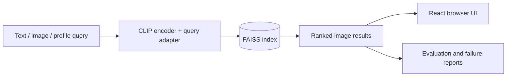

# Retina

Retina is a local visual search app built on CLIP embeddings, FAISS, and a small trainable query adapter.

It supports text-to-image, image-to-image, and profile-based search over a frozen CLIP backbone and a FAISS index. The repo includes training, evaluation, and a browser UI so the whole flow can be tried locally.

## Architecture



## What it includes

- Query adapter trained on Flickr8k captions
- FAISS-based retrieval
- FastAPI backend and React frontend
- Gradio demo
- Evaluation metrics and failure analysis

## Quick start

```bash
make install
make prepare-data
make embeddings
make train-query-adapter
make index
make eval
make api
make frontend
```

## Summary

Retina turns a local image catalog into a searchable product with measured retrieval quality and low-latency ranked results.

## Portfolio Proof

- Architecture and evaluation: [docs/PORTFOLIO_PROOF.md](docs/PORTFOLIO_PROOF.md)
- UI demo and result inspector: [docs/UI_DEMO.md](docs/UI_DEMO.md)
- Model comparison summary: [docs/MODEL_COMPARISON.md](docs/MODEL_COMPARISON.md)
- Verified metrics: the recall and latency numbers in the proof doc
- Demo and local mode: use the `make` commands above
- Test commands: `pytest`, `npm run build`
